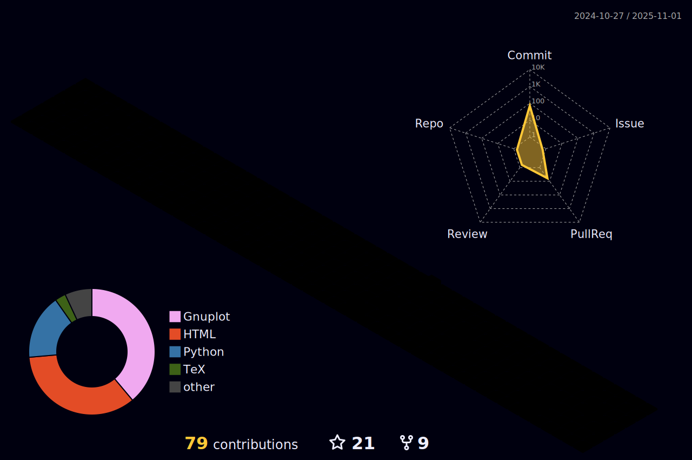

# Hi there! 👋 I'm Oscar, an Experimental and Computational Solid State Physicist from Mexico 🇲🇽

## About Me

<kbd style="font-size: 15px;">

- :electron: I hold a PhD in Photonics from [IICO/UASLP](http://www.iico.uaslp.mx/Paginas/Luis-Felipe.aspx) and teach Physics at [Universidad Politecnica de San Luis Potosi](https://www.upslp.edu.mx/upslp/)
- :green_circle: Currently, I'm focusing on learning DFT and bandstructure packages
- :green_circle: Ask me anything about Solid State Experimental Physics and Computational Calculation of Semiconductor Bandstructures
- :green_circle: You can reach me at:
  - Email: ruizoscar.1393@gmail.com, oscarruiz@cactus.iico.uaslp.mx, oscar.ruiz@upslp.edu.mx
- :green_circle: I am the founder of the institutional repository [NanophotonIICOs](https://github.com/NanophotonIICOs)
- ⚛️ Here is a [list of my scientific publications](https://scholar.google.es/citations?user=d5ygTH8AAAAJ&hl=es)

</kbd>

## Profile

  

## Technical Skills
<table>
  <tr>
    <td>OS</td>
    <td>
       
       
       
    </td>
  </tr>
  <tr>
    <td>Programming</td>
    <td>
       
       
       
       
       
       
       
    </td>
  </tr>
  <tr>
    <td>ML/DL</td>
    <td>
       
       
       
    </td>
  </tr>
  <tr>
    <td>Frameworks</td>
    <td>
       
    </td>
  </tr>
  <tr>
    <td>IDE/Editors</td>
    <td>
       
       
    </td>
  </tr>
  <tr>
    <td>Version Control</td>
    <td>
      
      
    </td>
  </tr>
  <tr>
    <td>Social</td>
    <td>
      
    </td>
  </tr>
</table>
 

<h2 align='center'>
  🖥️ My workspace is an OPTIPLEX 7010 (second hand)  
  
  
  
  
</h2>

<h2 align='center'>
  
</h2>

